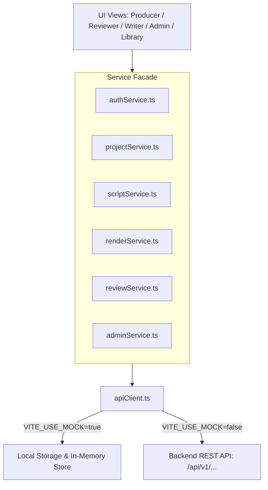

# TÀI LIỆU BÀN GIAO FRONT-END & ĐẶC TẢ TÍCH HỢP BACKEND (FE HANDOVER & API SPECIFICATION)

> **Dành cho**: Developer / AI Agent phụ trách phát triển Backend cho dự án **STEMotion** (Capstone Fall 2026).  
> **Cập nhật mới nhất**: Đã hoàn thiện phân tầng Service Layer (`src/services/`) và cấu hình chuyển đổi Dual-Mode Mock/Live (`VITE_USE_MOCK`).  
> **Mục tiêu**: Cung cấp toàn bộ ngữ cảnh kỹ thuật, data contract, cấu trúc response chuẩn, danh sách endpoints cụ thể và hướng dẫn tích hợp từng bước cho Backend.

---

## 1. TỔNG QUAN KIẾN TRÚC FRONT-END ĐÃ HOÀN THIỆN

Toàn bộ mã nguồn Front-End nằm tại repository: **`STEMotion_FE`**  
- **Tech Stack**: React 18 + Vite 5 + Tailwind CSS + Lucide Icons + KaTeX.
- **Engine Chuyển Động Video**: **Remotion 4.0** (`remotion`, `@remotion/player`). Khung hình 1080p, 60fps, render thời gian thực.
- **Hệ Thống Phân Quyền 5 Vai Trò (RBAC)**:
  1. **Producer Studio (Trọng tâm)**: Canvas video Remotion 60fps, Timeline đa phân cảnh (Scene Timeline), Props Inspector động thay đổi theo từng loại phân cảnh, Trình kích hoạt render MP4 qua hàng đợi BullMQ.
  2. **Reviewer QA**: Thẩm định video 2 chiều: Duyệt kịch bản (`APPROVED` / `CHANGE_REQUESTED`) và ghim góp ý theo mốc giây thời gian thực (`timestampSec`).
  3. **Writer Studio**: Trình soạn kịch bản tích hợp AI Intelligence (Tối ưu phân cảnh, Chấm độ khó sư phạm Flesch-Kincaid, Trích xuất khái niệm, Bắt lỗi thuật ngữ).
  4. **Admin Portal**: Giám sát GPU/CPU cluster, hàng đợi render BullMQ, quản lý giáo viên trong trường.
  5. **Thư Viện Media (Library)**: Kho template bài giảng STEM dùng chung (Toán, Lý, Hóa, Sinh, Tin).

---

## 2. KIẾN TRÚC TẦNG SERVICE LAYER (`src/services/`)

Front-End đã phân tầng Service chuẩn công nghiệp, tách biệt 100% logic giao diện (UI) khỏi tầng gọi mạng:



### 2.1. Cấu hình Môi trường kết nối (.env)
File cấu hình nằm tại `.env` trong thư mục gốc của FE:
```env
# URL gốc trỏ về Backend Server (Express / NestJS / FastAPI)
VITE_API_BASE_URL=http://localhost:8000/api/v1

# Cờ chuyển đổi chế độ:
# - true: FE tự chạy độc lập với mock data (dùng để demo khi chưa có server)
# - false: FE tự động bắn REST API thật sang Backend Server
VITE_USE_MOCK=false

VITE_ENABLE_DEBUG_LOGS=true
```

### 2.2. Chuẩn Header & Token Gửi Đi
Tất cả các request từ FE được `src/services/apiClient.ts` tự động đính kèm:
- `Content-Type: application/json`
- `Accept: application/json`
- `Authorization: Bearer <JWT_ACCESS_TOKEN>` (Tự động lấy từ `localStorage.getItem('stemotion_access_token')`)

### 2.3. Chuẩn Response Envelope (Bắt Buộc Backend Tuân Thủ)
Tất cả các API của Backend cần bọc trong cấu trúc JSON thống nhất sau:

**Thành công (HTTP 200 / 201):**
```json
{
  "success": true,
  "data": { ... }, // Đối tượng hoặc mảng dữ liệu trả về
  "meta": {
    "timestamp": "2026-09-19T16:45:00Z",
    "requestId": "req_abc123"
  }
}
```

**Thất bại (HTTP 4xx / 5xx):**
```json
{
  "success": false,
  "error": {
    "code": "PROJECT_NOT_FOUND", // Mã lỗi bằng chữ viết hoa
    "message": "Không tìm thấy dự án với ID đã cung cấp",
    "details": {}
  }
}
```

---

## 3. DATA MODELS & TYPESCRIPT INTERFACES (DATA CONTRACT)

Định nghĩa chuẩn tại file: [`src/types/stem.ts`](file:///d:/capstone/STEMotion_FE/src/types/stem.ts)

### 3.1. Dự Án & Kịch Bản (`STEMScript`)
```typescript
export type STEMSubject = 'Math' | 'Physics' | 'Chemistry' | 'Biology' | 'ComputerScience';
export type UserRole = 'producer' | 'reviewer' | 'writer' | 'admin' | 'library';

export interface STEMScript {
  id: string;                         // Ví dụ: "SCR-PHYS-9812"
  title: string;                      // Tên bài giảng: "Định luật bảo toàn cơ năng"
  subject: STEMSubject;               // "Math" | "Physics" | "Chemistry" | "Biology" | "ComputerScience"
  gradeLevel: string;                 // "Lớp 9" | "Lớp 10" | "Lớp 11" | "Lớp 12"
  totalDurationSeconds?: number;      // Thời lượng tổng (giây)
  scriptStatus: 'DRAFT' | 'IN_REVIEW' | 'APPROVED' | 'REJECTED' | 'CHANGE_REQUESTED';
  videoStatus?: 'NOT_RENDERED' | 'RENDERING' | 'IN_QA' | 'APPROVED' | 'PUBLISHED';
  fps?: number;                        // 30 hoặc 60
  scenes: SceneData[];                // Mảng các phân cảnh
  reviewComments?: FeedbackComment[]; // Bình luận phản biện
  createdAt?: string;
  version?: string;
}
```

### 3.2. Cấu Trúc Các Loại Phân Cảnh (`SceneData`)
Mỗi Scene thuộc 1 trong các kiểu sau:

```typescript
// 1. Tiêu đề bài giảng
export interface TitleHeroProps {
  id: string;
  type: 'TITLE_HERO';
  title: string;
  subtitle: string;
  subject: STEMSubject;
  gradeLevel: string;
  badgeText: string;
  narration: string;
  durationInFrames: number; // 30 frames = 1s
}

// 2. Công thức Toán / Lý (KaTeX)
export interface MathFormulaProps {
  id: string;
  type: 'MATH_FORMULA';
  title: string;
  latex: string;             // Ví dụ: "f(x) = ax^2 + bx + c"
  narration: string;
  durationInFrames: number;
  steps: {
    label: string;
    latexSnippet: string;
    explanation: string;
  }[];
}

// 3. Biểu đồ Dữ liệu
export interface DataChartProps {
  id: string;
  type: 'DATA_CHART';
  title: string;
  chartType: 'bar' | 'line';
  xAxisLabel: string;
  yAxisLabel: string;
  narration: string;
  durationInFrames: number;
  dataPoints: {
    label: string;
    value: number;
    color?: string;
  }[];
}

// 4. Thuật toán / Lập trình Tin học
export interface AlgorithmWalkthroughProps {
  id: string;
  type: 'ALGORITHM_WALKTHROUGH';
  title: string;
  language: string;          // "python" | "javascript"
  codeSnippet: string;
  narration: string;
  durationInFrames: number;
  steps: {
    lineHighlight: number;
    variableState: string;
    note: string;
  }[];
}

// 5. Câu hỏi trắc nghiệm tương tác
export interface STEMQuizProps {
  id: string;
  type: 'STEM_QUIZ';
  title: string;
  question: string;
  options: string[];         // 4 lựa chọn A, B, C, D
  correctIndex: number;      // 0, 1, 2, 3
  hint: string;
  explanation: string;
  narration: string;
  durationInFrames: number;
}

// 6. Tổng kết bài học
export interface OutroProps {
  id: string;
  type: 'OUTRO';
  title: string;
  summaryPoints: string[];
  nextLessonSuggestion: string;
  instructorName: string;
  narration: string;
  durationInFrames: number;
}

export type SceneData =
  | TitleHeroProps
  | MathFormulaProps
  | DataChartProps
  | AlgorithmWalkthroughProps
  | STEMQuizProps
  | OutroProps;
```

---

## 4. DANH SÁCH REST API ENDPOINTS CẦN TRIỂN KHAI

Tất cả các route dưới đây có tiền tố: `/api/v1`

### 4.1. Module Xác Thực (Auth)
* **`POST /api/v1/auth/login`**
  - **Request**: `{ "email": "teacher@edu.vn", "password": "secure_password" }`
  - **Response `data`**:
    ```json
    {
      "token": "eyJhbGciOiJIUzI1NiIsInR5cCI6IkpXVCJ9...",
      "user": {
        "id": "usr_001",
        "name": "Thầy Hoàng Nam",
        "email": "teacher@edu.vn",
        "role": "producer",
        "workspaceId": "ws_01",
        "workspaceName": "Tổ STEM THPT"
      }
    }
    ```

---

### 4.2. Module Quản Lý Dự Án (Projects)
* **`GET /api/v1/projects`**
  - **Query Params**: `?subject=Physics` (Optional)
  - **Response `data`**: Mảng `STEMScript[]`
* **`GET /api/v1/projects/:id`**
  - **Response `data`**: Đối tượng `STEMScript` chi tiết kèm các scenes.
* **`POST /api/v1/projects`**
  - **Mục đích**: Tạo mới đề tài bài giảng (khi giáo viên bấm `+ Đề Tài Mới`).
  - **Request**:
    ```json
    {
      "title": "Cân bằng phản ứng Oxi hóa khử",
      "subject": "Chemistry",
      "gradeLevel": "Lớp 10",
      "topicPrompt": "Giải thích phương pháp thăng bằng electron..."
    }
    ```
  - **Response `data`**: Đối tượng `STEMScript` vừa tạo kèm các default scenes.
* **`PUT /api/v1/projects/:id`**
  - **Request**: Cập nhật thông tin dự án (Partial updates).
* **`DELETE /api/v1/projects/:id`**
  - **Response `data`**: `{ "success": true }`

---

### 4.3. Module Kịch Bản & Phân Cảnh (Scripts & Scenes)
* **`POST /api/v1/scripts/generate`** (AI Orchestration)
  - **Mục đích**: Nhận đề tài từ giáo viên -> Gọi mô hình LLM (Gemini 1.5 Pro / GPT-4o) -> Trả về kịch bản chuẩn cấu trúc các phân cảnh STEM.
  - **Request**:
    ```json
    {
      "prompt": "Hướng dẫn định luật II Newton với ví dụ xe lăn chở vật nặng",
      "subject": "Physics",
      "gradeLevel": "Lớp 10"
    }
    ```
  - **Response `data`**: Đối tượng `STEMScript` hoàn chỉnh với đầy đủ các Scene chứa KaTeX và biểu đồ.
* **`POST /api/v1/projects/:id/scenes`**
  - **Mục đích**: Thêm một phân cảnh mới vào Timeline.
  - **Request**: Đối tượng `SceneData`.
* **`PUT /api/v1/projects/:id/scenes/:sceneId`**
  - **Mục đích**: Cập nhật thuộc tính của phân cảnh khi giáo viên chỉnh sửa trong Props Inspector (sửa LaTeX, sửa biểu đồ, sửa câu hỏi).
  - **Request**: Đối tượng `SceneData` đã cập nhật.
* **`DELETE /api/v1/projects/:id/scenes/:sceneId`**
  - **Mục đích**: Xóa phân cảnh khỏi kịch bản.

---

### 4.4. Module Thẩm Định & Kiểm Duyệt (Reviews & Comments)
* **`POST /api/v1/projects/:id/reviews`**
  - **Mục đích**: Reviewer nộp quyết định thẩm định kịch bản.
  - **Request**:
    ```json
    {
      "decision": "APPROVED", // hoặc "CHANGE_REQUESTED"
      "feedbackNote": "Nội dung đạt chuẩn chương trình GDPT 2018."
    }
    ```
  - **Response `data`**: `{ "status": "APPROVED", "message": "..." }`
* **`POST /api/v1/projects/:id/comments`**
  - **Mục đích**: Reviewer ghim nhận xét vào mốc giây trên video.
  - **Request**:
    ```json
    {
      "author": "ThS. Trần Thị B (Reviewer)",
      "avatar": "👩‍🏫",
      "role": "Reviewer",
      "timestampSec": 15.2,
      "content": "Công thức Delta ở giây 15 cần đổi màu nổi bật hơn.",
      "status": "OPEN",
      "createdAt": "Vừa xong"
    }
    ```
  - **Response `data`**: Đối tượng `FeedbackComment` kèm `id` tạo từ DB.
* **`PUT /api/v1/projects/:id/comments/:commentId/resolve`**
  - **Mục đích**: Đánh dấu nhận xét đã được xử lý xong.

---

### 4.5. Module Kết Xuất Video Remotion (Renders & BullMQ)
* **`POST /api/v1/renders`**
  - **Mục đích**: Producer bấm "Xuất Video MP4" -> Đưa Job render vào hàng đợi Redis/BullMQ.
  - **Request**:
    ```json
    {
      "projectId": "SCR-PHYS-9812",
      "resolution": "1080p",
      "fps": 60
    }
    ```
  - **Response `data`**:
    ```json
    {
      "id": "rnd_job_7721",
      "projectId": "SCR-PHYS-9812",
      "status": "QUEUED",
      "progressPercentage": 0,
      "resolution": "1080p",
      "fps": 60,
      "createdAt": "2026-09-19T16:45:00Z"
    }
    ```
* **`GET /api/v1/renders/:renderId`**
  - **Mục đích**: FE polling tiến độ render hiển thị thanh loading cho người dùng.
  - **Response `data`**:
    ```json
    {
      "id": "rnd_job_7721",
      "projectId": "SCR-PHYS-9812",
      "status": "RENDERING", // "QUEUED" | "RENDERING" | "COMPLETED" | "FAILED"
      "progressPercentage": 65,
      "outputUrl": "https://storage.googleapis.com/stemotion/renders/SCR-PHYS-9812.mp4", // Khi status = COMPLETED
      "errorMessage": null
    }
    ```

---

### 4.6. Module Quản Trị & Thư Viện (Admin & Library)
* **`GET /api/v1/admin/metrics`**: Trả về thống kê CPU, GPU, Memory, số render jobs trong ngày.
* **`GET /api/v1/library/templates`**: Trả về danh sách template công thức, sơ đồ STEM dùng chung.

---

## 5. HƯỚNG DẪN DÀNH CHO AI CỦA TEAMMATE ĐỂ CODE BACKEND

Khi teammate bắt đầu xây dựng Backend, hãy copy toàn bộ đoạn Prompt dưới đây và gửi cho AI của họ:

```markdown
Bạn là Backend AI Software Engineer cho dự án STEMotion (Nền tảng sản xuất video bài giảng STEM bằng Remotion).
Hãy đọc kỹ tài liệu bàn giao `BACKEND_API_SPEC.md` trong thư mục `STEMotion_FE` để nắm toàn bộ hợp đồng API (API Contract).

Nhiệm vụ của bạn là xây dựng Backend hoàn chỉnh với các yêu cầu sau:
1. Công nghệ đề xuất: Node.js (NestJS hoặc Express + TypeScript) hoặc Python (FastAPI).
2. Cơ sở dữ liệu: PostgreSQL (sử dụng Prisma ORM) hoặc Supabase.
3. AI Orchestrator: Tích hợp Google Gemini 1.5 Pro API (`@google/genai`) để sinh kịch bản JSON theo đúng Interface `STEMScript` và `SceneData` được định nghĩa trong file `src/types/stem.ts`.
4. Text-To-Speech (TTS): Tích hợp Edge-TTS hoặc Google Cloud TTS để chuyển text lời thoại (`narration`) thành file âm thanh .mp3 giọng đọc tiếng Việt chuẩn sư phạm.
5. Video Render Worker: Cài đặt `@remotion/renderer` để đọc cấu trúc `STEMScript` và render ra file video `.mp4` chuẩn 1080p60.
6. Tuân thủ tuyệt đối cấu trúc Response Envelope:
   { "success": true, "data": { ... }, "meta": { ... } }
7. Đảm bảo toàn bộ các endpoint trong mục 4 của tài liệu này hoạt động chính xác với tiền tố `/api/v1`.
```

---

*Tài liệu bàn giao kỹ thuật chính thức — STEMotion Capstone Project FALL 2026.*
